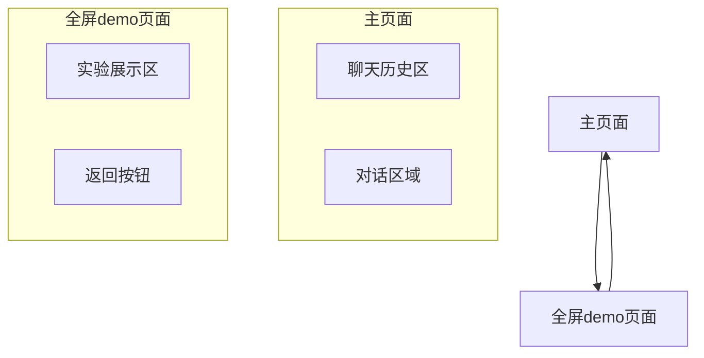

# 交互式实验Demo生成平台 - 产品需求文档

## 1. 产品概述

一个基于AI的交互式实验demo生成平台，用户通过自然语言描述实验需求，AI自动生成可交互的HTML实验演示。平台采用类似OpenAI官网的简洁设计风格，提供直观的聊天界面和实验生成体验。

该平台解决了科研人员、教育工作者和学生快速创建实验演示的需求，通过AI技术大幅降低了实验demo制作的技术门槛和时间成本。

目标是成为实验教学和科研展示领域的重要工具，提升实验可视化的效率和质量。

## 2. 核心功能

### 2.1 功能模块

我们的交互式实验demo生成平台采用极简设计，包含以下核心页面：

1. **主页面**：左右分区布局，左侧聊天历史，右侧对话区域
2. **全屏demo页面**：实验展示页面，左上角返回按钮

### 2.2 页面详情

| 页面名称 | 模块名称 | 功能描述 |
|----------|----------|----------|
| 主页面 | 聊天历史区 | 左侧固定区域，显示历史对话记录，支持快速切换和查看 |
| 主页面 | 对话区域 | 右侧主要区域，显示当前对话内容和用户输入框 |
| 主页面 | 状态指示器 | 显示AI处理进度（解析需求→获取知识→生成代码→渲染实验） |
| 全屏demo页面 | 实验展示区 | 全屏显示生成的HTML实验demo，支持交互操作 |
| 全屏demo页面 | 返回按钮 | 左上角返回按钮，点击回到主页面对话界面 |

## 3. 核心流程

**主要用户操作流程：**

用户在右侧对话区域输入实验需求 → AI解析并确认实验类型 → 系统通过Wiki MCP获取实验知识 → AI生成HTML实验代码 → 自动跳转到全屏demo页面展示实验 → 用户可通过左上角返回按钮回到对话界面

**AI工作流程：**

大模型接收用户输入 → 自然语言理解确定实验类型和参数 → 调用Wiki MCP获取实验原理和步骤 → 基于知识生成交互式HTML代码 → 返回可执行的实验demo

## 4. 用户界面设计

### 4.1 设计风格

- **主色调**：黑色系(#000000, #1a1a1a, #2a2a2a)，背景色为深色(#0f0f0f, #1a1a1a)
- **文字颜色**：浅色系(#ffffff, #e5e5e5, #a0a0a0)，确保在深色背景下的可读性
- **彩色元素**：低饱和度颜色(#4a5568, #718096, #2d3748)，避免过于鲜艳的色彩
- **按钮样式**：弧度很低的圆角矩形按钮(border-radius: 4px)，深色背景配浅色文字，悬停时有微妙的阴影效果
- **字体**：Inter字体，标题18-24px，正文14-16px，代码区域使用Fira Code
- **布局风格**：融合式布局，无明显分区边界，使用细线分割(1px, #2a2a2a)或渐变过渡，元素间距保持一致(gap: 8px)
- **分区设计**：移除圆角矩形容器，采用无缝融合的视觉效果，通过背景色差异和细线分割区分功能区域
- **卡片样式**：去除明显边框，使用微妙的背景色差异(#1a1a1a vs #0f0f0f)和阴影效果区分层次
- **输入框样式**：弧度很低的圆角矩形输入框(border-radius: 4px)，深色背景配浅色文字，与整体背景融合
- **图标风格**：使用Heroicons线性图标，浅色图标适配暗色主题

### 4.2 页面设计概览

| 页面名称 | 模块名称 | UI元素 |
|----------|----------|--------|
| 主页面 | 聊天历史区 | 左侧固定宽度区域，深色背景(#1a1a1a)无边框设计，与右侧区域通过细线分割(1px, #2a2a2a)，对话历史紧凑排列，间距8px |
| 主页面 | 对话区域 | 右侧主要区域，深色背景(#0f0f0f)无容器边界，对话气泡使用微妙背景色差异，浅色文字，底部输入框与整体背景融合 |
| 全屏demo页面 | 实验展示区 | 全屏深色背景(#0f0f0f)，无边框设计，与页面背景完全融合 |
| 全屏demo页面 | 返回按钮 | 左上角悬浮式返回按钮，微妙阴影效果，浅色箭头图标，与背景自然融合 |

### 4.3 响应式设计

产品采用桌面优先的响应式设计。在桌面端采用左右分区布局，左侧聊天历史区固定宽度，右侧对话区域自适应。在移动端，聊天历史区收缩为可滑出的侧边栏，对话区域占据全屏宽度。全屏demo页面在所有设备上都采用全屏显示，返回按钮在移动端适当增大触摸区域。