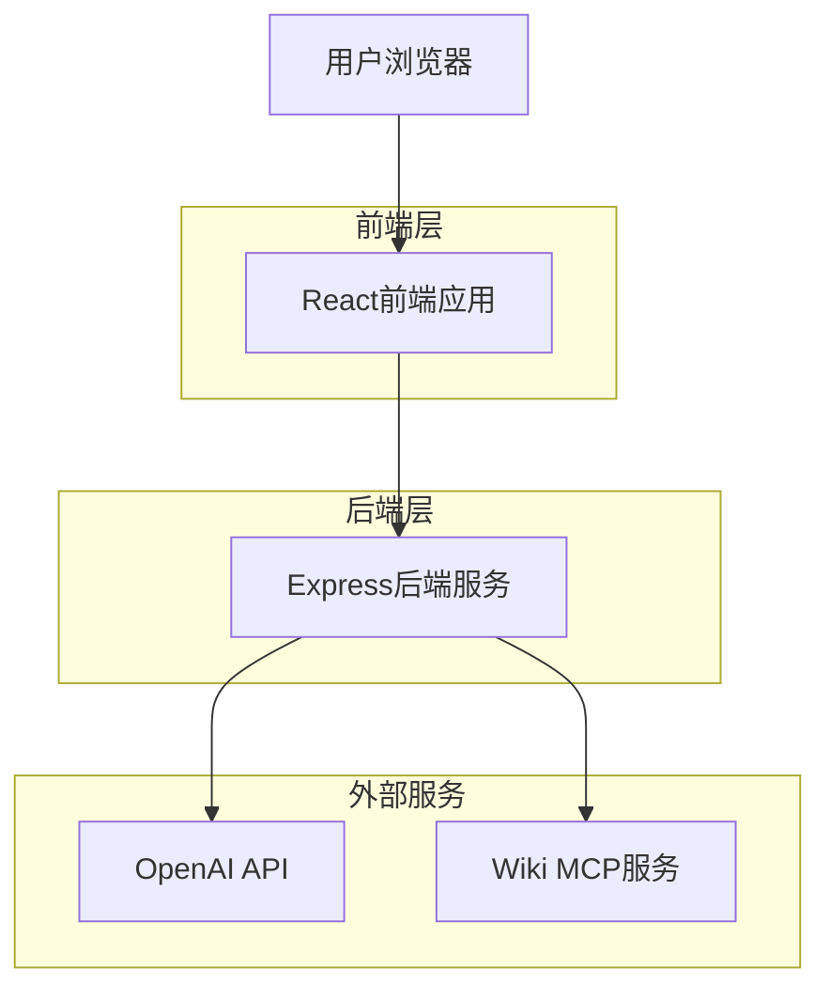
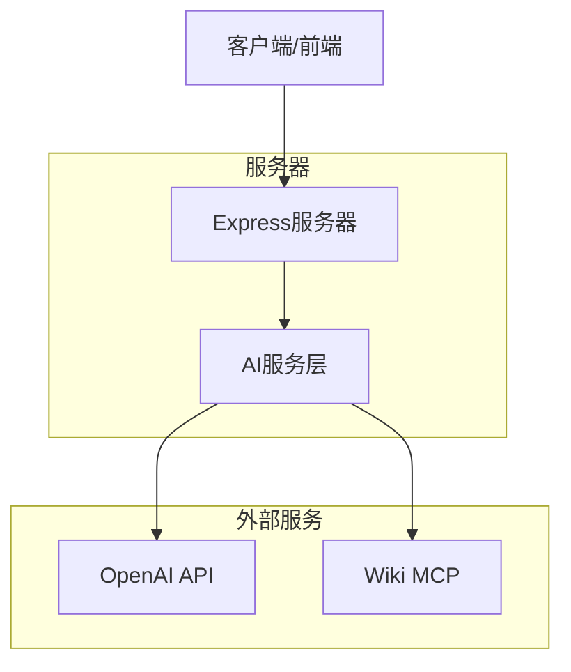

# 交互式实验Demo生成平台 - 技术架构文档

## 1. 架构设计



## 2. 技术描述

- 前端：React@18 + TypeScript + Tailwind CSS + Vite
- 后端：Express@4 + TypeScript
- AI服务：OpenAI GPT-4 API
- 知识获取：Wiki MCP (Model Context Protocol)

## 3. 路由定义

| 路由 | 用途 |
|------|------|
| / | 主页面，左侧聊天历史，右侧对话区域 |
| /demo/:id | 全屏demo页面，展示生成的实验，左上角返回按钮 |

## 4. API定义

### 4.1 核心API

**实验生成相关**
```
POST /api/experiments/generate
```

请求：
| 参数名 | 参数类型 | 是否必需 | 描述 |
|--------|----------|----------|------|
| prompt | string | true | 用户的实验需求描述 |
| conversation_id | string | false | 对话ID，用于多轮对话 |

响应：
| 参数名 | 参数类型 | 描述 |
|--------|----------|------|
| experiment_id | string | 生成的实验ID |
| html_content | string | 生成的HTML实验代码 |
| css_content | string | 生成的CSS样式代码 |
| js_content | string | 生成的JavaScript代码 |
| parameters | array | 可调节的实验参数列表 |
| status | string | 生成状态 |

示例：
```json
{
  "prompt": "我想要一个展示单摆运动的物理实验",
  "conversation_id": "conv_123456"
}
```

## 5. 服务器架构图

